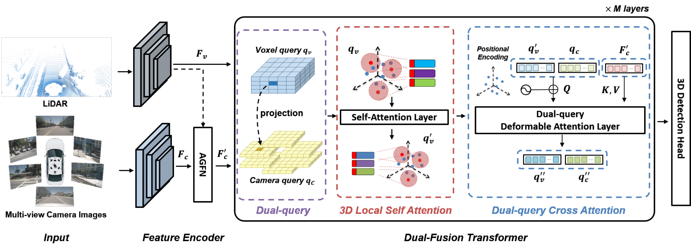

# 3D Dual-Fusion

This project is the official implementation of [3D Dual-Fusion: Dual-Domain Dual-Query Camera-LiDAR Fusion for 3D Object Detection](https://arxiv.org/abs/2211.13529). We added the proposed modules to CenterPoint and TransFusion in NuScenes dataset and Voxel-RCNN in KITTI dataset. built on [mmdetection3d](https://github.com/open-mmlab/mmdetection3d), [OpenPCDet](https://github.com/open-mmlab/OpenPCDet), and [Det3d](https://github.com/poodarchu/Det3D). If our project was helpful to you, please cite: 

```latex
@article{kim20223ddf,
  title={3D Dual-Fusion: Dual-Domain Dual-Query Camera-LiDAR Fusion for 3D Object Detection},
  author={Kim, Yecheol and Park, Konyul and Kim, Minwook and Kum, Dongsuk and Choi, Jun Won},
  journal={arXiv preprint arXiv:2211.13529, 3D-DF | DeepLabV3 | 67.3 | 77.1 | TBD |
  year={2022}
}
```

## Introduction

Fusing data from cameras and LiDAR sensors is an essential technique to achieve robust 3D object detection. One key challenge in camera-LiDAR fusion involves mitigating the large domain gap between the two sensors in terms of coordinates and data distribution when fusing their features. In this paper, we propose a novel camera-LiDAR fusion architecture called, 3D Dual-Fusion, which is designed to mitigate the gap between the feature representations of camera and LiDAR data. The proposed method fuses the features of the camera-view and 3D voxel-view domain and models their interactions through deformable attention. We redesign the transformer fusion en- coder to aggregate the information from the two domains. Two major changes include 1) dual query-based deformable attention to fuse the dual-domain features interactively and 2) 3D local self-attention to encode the voxel-domain queries prior to dual- query decoding. The results of an experimental evaluation show that the proposed camera-LiDAR fusion architecture achieved competitive performance on the KITTI and nuScenes datasets, with state-of-the-art performances in some 3D object detection benchmark categories.



## Main Results

### KITTI Car 3D object detection validation

| Model | Easy | Mod | Hard | Link |
| --- | --- | --- | --- | --- |
| Voxel R-CNN | 89.41 | 84.52 | 78.93 | - |
| Voxel R-CNN + 3D-DF | 92.80 | 85.96 | 83.62 | TBD |

### NuScenes 3D object detection validation

| 3D Model | 2D Model | mAP | NDS | Link |
| --- | --- | --- | --- | --- |
| CenterPoint | - | 59.6 | 66.8 | - |
| CenterPoint + 3D-DF | DeepLabV3 | 67.3 | 77.1 | TBD |
| TransFusion-L | - | 65.1 | 70.1 | TBD |
| TransFusion-L + 3D-DF | ResNet50 | 69.3 | 72.2 | TBD |
| TransFusion-L + 3D-DF | Swin-Tiny | 70.6 | 72.9 | TBD |

## Acknowledgement

We sincerely thank the authors of  [FocalsConv](https://github.com/dvlab-research/FocalsConv), [TransFusion](https://github.com/XuyangBai/TransFusion), [mmdetection3d](https://github.com/open-mmlab/mmdetection3d), [det3d](https://github.com/poodarchu/Det3D), and [OpenPCDet](https://github.com/open-mmlab/OpenPCDet).
